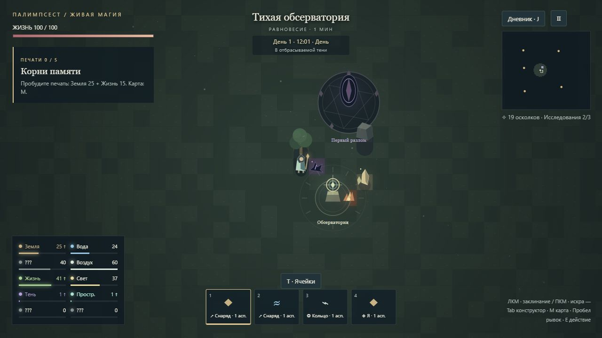
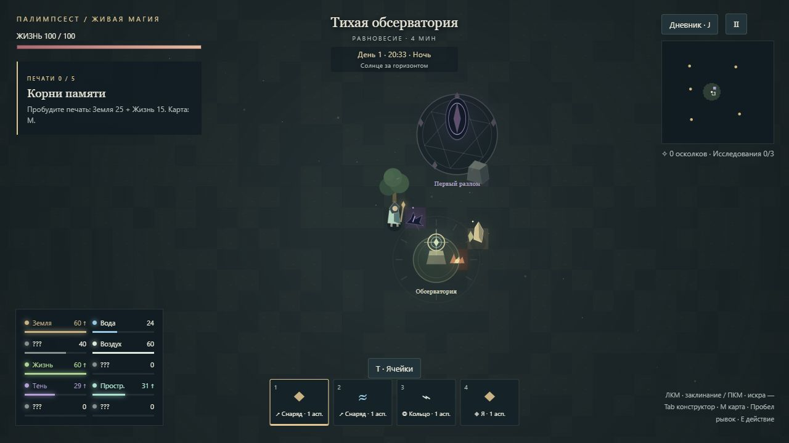

# День, ночь и тени — этап V

Версия 1.4.0. Описание механики для разработчиков содержит открытия игрока.

## Солнечный цикл

Сутки занимают 480 секунд активной симуляции. Новая история начинается в 08:00, полдень — в 12:00, световой день длится с 06:00 включительно до 18:00. Рассвет — 06:00–08:00, закат — 16:00–18:00. Часы и номер дня вычисляются из уже сохраняемого времени путешествия; отдельного таймера или обращения к системным часам нет. Пауза, потеря фокуса и закрытая игра не двигают цикл.

Солнце движется с востока на запад. Утром тени направлены влево, вечером вправо, в полдень становятся короче. Это условная геометрия игрового мира, а не астрономическая модель местности.

## Источники

| Условия | Свет | Тень |
|---|---|---|
| День, прямое солнце | 1,12–3,2 единицы в секунду, максимум в полдень | 0 |
| День, тень дерева или скалы | 0 | 2,6 в секунду |
| Ночь, рядом с разломом | 0 | 2,6 в секунду |
| Ночь, остальное окружение | 0 | 0 |

Реликвия сбора применяет прежний множитель 1,35. Солнечный и теневой источники взаимоисключающие. Кристаллы и восстановленные печати остаются видимыми ориентирами, но больше не наполняют световой сосуд. Плоский тайл руин сам по себе не даёт тень. Разлом по-прежнему даёт пространство, а теневую ману теперь отдаёт только ночью.

Обычная ночная темнота не является источником: игрок меняет маршрут подготовки, ищет разлом или заранее запасает ману. В каждой проверенной стартовой области есть доступные дневные тени, открытые места и ночной разлом. Другие восемь источников и затраты заклинаний не изменены.

## Геометрия и магия

Дерево и скала отбрасывают капсулу на землю: проекция от основания с постоянной шириной и длиной, зависящей от положения солнца. Общий модуль `daylight.js` выдаёт фигуру для Canvas и проверяет, попадают ли в неё ноги мага. Количество перекрывающихся теней не умножает сбор.

Расчёт использует текущее содержимое тайлов. Жизнь может вырастить рощу и создать теневой источник. Огонь уничтожает деревья и открывает солнце; земля разбирает скалу, также меняя освещённость. Изменение источника учитывается со следующего шага симуляции. Игровые стены с отдельной прочностью остаются следующим этапом.

Ночью земля темнее, солнечные проекции исчезают; существующие светящиеся объекты и атаки сохраняют читаемость. Деревья и скалы — единственные объекты, создающие ресурсную тень на этом этапе. Существа, эффекты заклинаний и декоративные сооружения её не создают.

## Открытия и сохранения

Источники солнца, отбрасываемой тени и ночного разлома фиксируются только после наблюдения подходящих условий. Названия неизвестных аспектов заранее не раскрываются. Индикатор под часами описывает освещение у ног мага, не обещая заранее тип маны.

Формат сохранения 4 переносит версии 1–3. Время, рецепты, мана, печати, исследования, бюджеты событийной маны и таймеры материалов сохраняются. Устаревшие записи о кристаллах, печатях, руинах и дневных разломах удаляются, но названия уже открытых аспектов остаются известными. Новые факты не создаются миграцией: их нужно наблюдать. Повреждённые данные не исправляются выдуманными открытиями; загрузчик использует прежний резервный слот.

## Проверка

`npm test` проверяет геометрию и реальные источники, магические изменения окружения, границы суток, паузу, загрузку и стартовые маршруты. Для повторения UI-проверки доступны отдельные сцены «Полдень в тени», «Ночь у разлома» и «Сохранение v3 со старыми источниками» на `http://localhost:4173/tests/discovery-setup.html`. Кнопка восстановления возвращает тестовое путешествие; стенд не входит в Windows-сборку.

