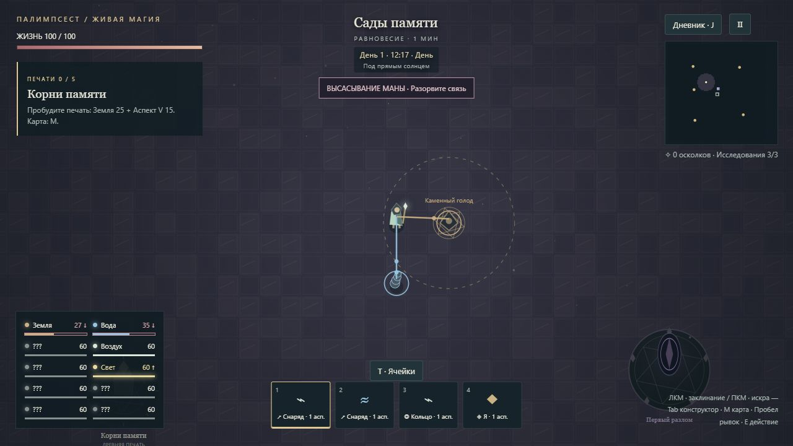
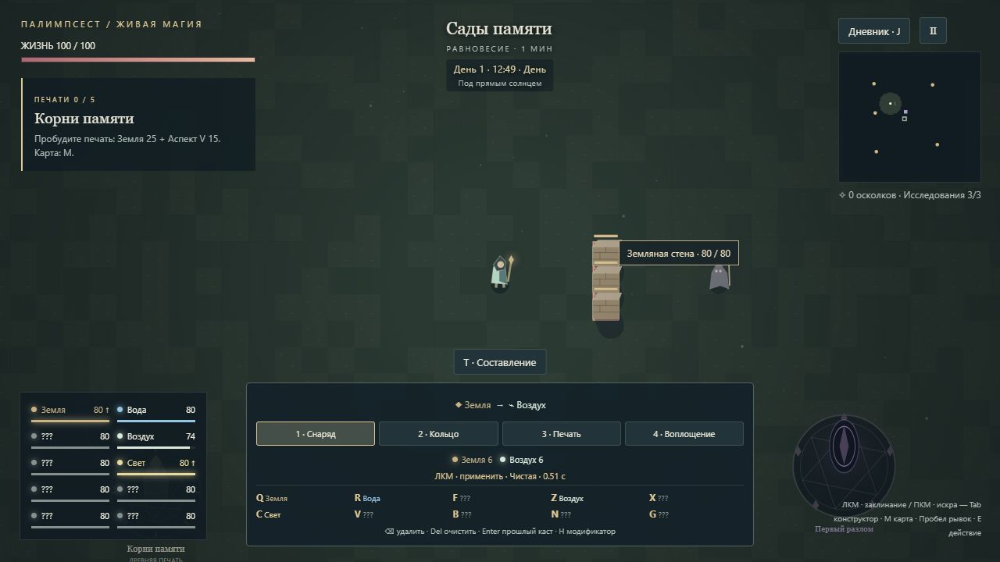
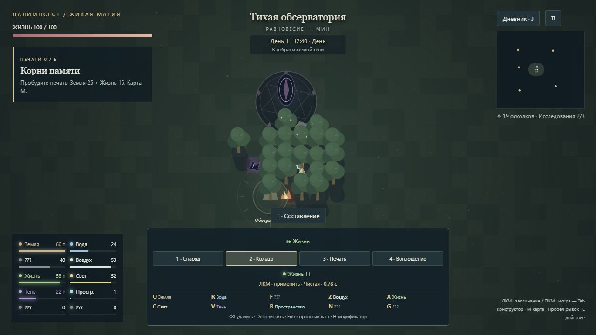
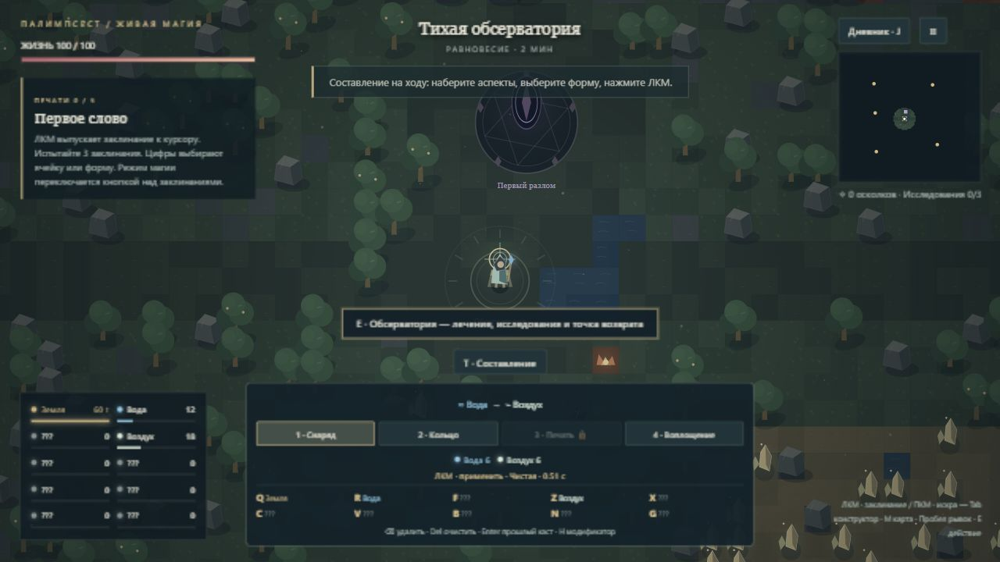

# Проверки прототипа

## Седьмой этап: версия 1.6.0

Проходят 104 автоматические проверки. Новые 14 покрывают подготовку, конкретный сосуд и нулевой остаток, несколько источников, укрытие построенной стеной, уход за радиус, прерывание попаданием, страх и оглушение, четыре платные контрмеры, бесплатную искру с настоящей дальностью, одноразовую награду, паузу, миграцию, сохранение угасших ядер и безопасное появление на 12 мирах.

При 1280×720 в обычном интерфейсе проверены предупреждение, две цветные связи и стрелки ↓: уменьшались земля и вода, здоровье оставалось 100. На пустых сосудах связи прекратились. После рывка из зоны запасы оставались 26 земли и 34 воды. Бесплатная искра погасила каменный голод и дала 3 осколка; запись в дневнике и угасшее ядро сохранились после перезапуска. Исправлены найденные при ручной проверке пролёт искры через ядро и перекрытие предупреждения уведомлениями. Ошибок консоли нет, отдельное тестовое путешествие восстановлено, размер окна возвращён.

Windows-сборка 1.6.0 прошла запуск в отдельном профиле: packaged=true, ошибок renderer нет, код выхода 0.

Полное прохождение кампании с новыми угрозами и независимая оценка баланса пока не выполнены.

## Шестой этап: версия 1.5.0

Проходят 90 автоматических проверок. Новые 14 проверяют платное строительство четырьмя формами, защиту проходов и мест появления, столкновения при рывке и быстрых снарядах, материал и прочность, разрушение врагом, бесплатную разборку, отсутствие ремонта повторной печатью, предел стен, миграцию и валидацию сохранений.

При 1280×720 через обычный интерфейс построен заслон из земли и воздуха. Он принимал выстрелы стрелка, здоровье мага оставалось 100. Огонь изменил прочность до 120, вода до 50; бесплатная искра оставила 22. После паузы и перезагрузки сохранились материал и 22 прочности. Повторная искра разрушила участок, на его месте удалось построить новый. Проверены клавиатурное составление, подсказка материала и полоски прочности. Тестовое путешествие восстановлено.

Windows-сборка 1.5.0 прошла запуск в отдельном профиле: packaged=true, ошибок renderer нет, код выхода 0.

Длительное прохождение всей кампании со стенами и независимая оценка баланса ещё нужны.

## Пятый этап: версия 1.4.0

Проходят 76 автоматических проверок. Десять новых покрывают границы рассвета/заката, общий расчёт теней и источников для разных положений солнца, платное выращивание и уничтожение укрытия, ночные источники, остановку в паузе, перенос v3 без потери прогресса, некорректное время и доступность источников возле лагеря на 12 начальных мирах.

При 1280×720 в обычном интерфейсе подготовленной сцены проверены тень в полдень, выход рывком на солнце и записи двух источников в дневнике. Ночью у разлома собиралась тень, после выхода из его окрестности — нет; свет не собирался. Кольцо жизни за 11 маны создало рощу и теневой источник, кольцо огня убрало тень и возобновило сбор света. После перезагрузки продолжилось то же время суток. Сохранение v3 сохранило 19 осколков, исследование II и 37 света; старое утверждение о световой мане кристаллов больше не показывалось. Ошибок консоли нет, тестовое путешествие восстановлено.

Windows-сборка 1.4.0 прошла запуск с отдельным профилем: packaged=true, ошибок renderer нет, код выхода 0, изоляция включена.

Длительное прохождение с чередованием дня и ночи и независимая оценка баланса пока не выполнены.

## Четвёртый этап: версия 1.3.0

Проходят 66 автоматических проверок. Семь новых проверяют назначения и обмен конфликтующих клавиш, восстановление повреждённых настроек, реальное платное применение составного рецепта, раздельность ячеек и черновика, повтор только успешного каста, ограничения исследований и очистку временного рецепта при загрузке другого путешествия.

При 1280×720 через обычный интерфейс проверены: T для смены режима; R, Z, 1 и ЛКМ для инея с расходом 6 воды и 6 воздуха; Delete и Enter для очистки и возврата; отказ формы 3 без исследования; предел пяти аспектов; H для усиления и обновление цены. Назначение воды перенесено с R на занятую Q: земля получила R. После перезапуска сохранены назначения и режим. Черновик через Tab записан в ячейку 4 и появился в режиме ячеек. Оба экрана помещаются в окне, ошибок консоли нет. Проверка использовала отдельное браузерное путешествие localhost; настольное сохранение не изменялось.

Windows-сборка 1.3.0 прошла запуск в отдельном профиле: packaged=true, ошибок renderer нет, код выхода 0. Проверен также выбор формы мышью.

Проверка не заменяет длительное прохождение с новым управлением или независимый тест эргономики.

## Третий этап: версия 1.2.0

Проходят 59 автоматических проверок. Новые проверки охватывают все 111 110 последовательностей длиной 1–5 на корректность разбора (это не проверка баланса), стоимость и отказ без частичного списания, порядок реакций, повторы, шесть реакций во всех четырёх формах, эхо, цепь, сопротивления, однократные награды, корни, сохранение таймеров и миграцию версий 1–3.

При 1280×720 мышью проверены добавление пяти аспектов, запрет шестого, перестановка, удаление, очистка, запрет записи пустого рецепта и пересчёт стоимости. Кнопка записи полностью помещается на экран. В обычной игре из подготовленной сцены применены вода → воздух и воплощение жизни → земли: открылись иней и живая кора, здоровье выросло с 65 до 79, щит — до 51. После паузы и перезагрузки сохранились рецепт, форма, здоровье и щит. Дневник показывает сочетания после наблюдения. Ошибок консоли нет; исходное тестовое путешествие восстановлено.

Упакованная Windows-версия 1.2.0 прошла проверку запуска с отдельным профилем: код выхода 0, ошибок renderer нет, изоляция включена.

Полное ручное прохождение новой грамматикой и независимая оценка баланса ещё не выполнены.

## Второй этап: версия 1.1.0

Проходят 41 автоматическая проверка: 28 предыдущих и 13 новых. Проверены фактический урон, щиты и самоурон, постоянные бюджеты крови, смерть один раз, призывы, вклад созданного огня, отсутствие повторного заселения мира, свойства новых заклинаний, наблюдения и миграция версии 1.

При 1280×720 в обычном интерфейсе проверены новая история, неизвестные аспекты в конструкторе, запись водного рецепта мышью, применение и запись изменения почвы в дневник. В подготовленной боевой сцене тремя целями получены 18 крови и 12 смерти; кровь вылечила с 65 до 89, смерть дала щит 24. После перезапуска остались 8 крови, 2 смерти, щит и знания. При миграции сохранены 19 осколков, исследование II и подготовленная жизнь; повреждение основного слота восстановило историю из резервного. Ошибок консоли нет. Тестовая сцена использует отдельный адрес localhost и не входит в сборку.

Упакованная Windows-версия 1.1.0 успешно запущена с отдельным профилем: `ok: true`, `packaged: true`, код выхода 0, ошибок загрузки нет.

Боевая сцена использует неподвижные цели для проверки стоимости и интерфейса. Проверка динамических столкновений всех печатей и финала остаётся в автоматических тестах; полное новое человеческое прохождение не заявляется.

## Первый этап развития прототипа

В `feature/elemental-combat-foundation` проходят 28 тестов: исходные 17 и 11 проверок свойств существ, среды, страха, фактического урона и совместимости сохранений. В браузере при 1280×720 проверен стенд `tests/combat-scene.html`: страх изгнанника 4,3 с после попадания тьмы; голем получил 6 урона от огненного снаряда без горения; корнеед потерял здоровье на огне и погас после входа в воду. Ошибок в консоли стенда нет. Стенд не включается в Windows-дистрибутив.

Далее сохранён исходный отчёт прототипа, чтобы отличать проверки разных этапов.

## Автоматические

Команда: `npm test`. Проверяются:

1. Детерминированная генерация и доступность пяти печатей на 50 семенах.
2. Все 192 комбинации, положительные стоимости и объединение одинаковых валют.
3. Атомарное списание: нехватка одной маны не расходует другие.
4. Условный сбор, отсутствие общей пассивной регенерации.
5. Доступность восьми источников в окрестностях стартового лагеря.
6. Преобразования материи и непроницаемая граница мира.
7. Попадание заклинания в выбранную точку земли.
8. Запрет бесплатного каста и единоразовая стоимость эха.
9. Лечение, щит, рывок и телепорт с проверкой препятствий.
10. Урон вражеских снарядов и смерть от горения.
11. Возвращение после гибели и сохранение прогресса.
12. Цепочка: пробуждение, стражи, восстановление, реликвии, исследования, финал.
13. Отказ от повреждённых сохранений.
14. Устойчивость при пяти минутах симуляции и границы запасов маны.
15. Первая печать: реальный бой с обычными платными заклинаниями.
16. Остальные четыре печати: реальные бои подготовленного персонажа.
17. Переписчик: бой через реальные снаряды, без прямого уменьшения его здоровья тестом.

Боевые тесты используют подготовленные стартовые позиции и заполненные сосуды. Они проверяют возможность победы, а не полное человеческое прохождение, время игры или все варианты стратегии. Тест переходов состояния отдельно использует прямой урон для изоляции логики прогресса.

## Визуальная и интерактивная проверка

В браузере проверены главное меню, выбор сложности, вступление, игровой HUD, конструктор, запись рецепта, применение магии, пауза и продолжение сохранения. Проверяется отсутствие ошибок консоли. При проверке обнаружены и исправлены: меню под Canvas, потеря слишком короткого клика, отсутствие завершения полёта на целевой земле, сбой очистки снарядов в момент победы над боссом.

Автопауза при потере фокуса и ручная пауза защищают персонажа во время переключения приложений. Все экраны конструктора и дневника останавливают симуляцию.

## Настольная сборка

Упакованный `Palimpsest.exe` на Electron 41.10.7 запущен с отдельным чистым тестовым профилем. Результат: `ok: true`, `packaged: true`, ошибок загрузки renderer нет, код выхода 0. Встроенная изоляция Electron осталась включена. Проверка запуска из ограниченной командной среды потребовала повторного запуска с обычными правами: это не изменение настроек безопасности самой игры.

Аудит зависимостей после обновления упаковщика до 20.3.0: 0 известных уязвимостей. Это результат аудита на момент сборки, а не гарантия отсутствия любых дефектов.
